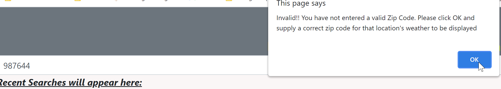

# 06-Weather Dashboard using Server-Side APIs:

## Task

This week's challenge is to build a weather dashboard that will run in the browser and feature dynamically updated HTML and CSS alongside the use of [OpenWeather One Call API](https://openweathermap.org/api/one-call-api) to retrieve weather data for cities and `localStorage` to store any persistent data.

## User Story

```
AS A traveler I WANT to see the weather outlook for multiple cities SO THAT I can plan a trip accordingly
```

## Acceptance Criteria

```
GIVEN a weather dashboard with form inputs
✓ WHEN I search for a city THEN I am presented with current and future conditions for that city and that city is added to the search history
✓ WHEN I view current weather conditions for that city THEN I am presented with the city name, the date, an icon representation of weather conditions, the temperature, the humidity, the wind speed, and the UV index
✓ WHEN I view the UV index THEN I am presented with a color that indicates whether the conditions are favorable, moderate, or severe
✓ WHEN I view future weather conditions for that city THEN I am presented with a 5-day forecast that displays the date, an icon representation of weather conditions, the temperature, the wind speed, and the humidity
✓ WHEN I click on a city in the search history THEN I am again presented with current and future conditions for that city
```

--------------------------------
# DNB's SOLUTION: 
UNC Boot Camp Submission: 🗂️[Github Repository](https://github.com/DionneNoellaBarretto/06-Weather-Dashboard-API) | 📄[Github Page]( https://dionnenoellabarretto.github.io/06-Weather-Dashboard-API/)

--------------------------------

### Application Views
Starting Screen: 
ZipCode City Search: 
City Name City Screen: 
InvalidZipCode/CityName Prompts:  
Readings: 
Search Functionality: 

## Grading Requirements

This homework is graded based on the following criteria: 

### Technical Acceptance Criteria: 40%

```
✅ Satisfies all of the preceding acceptance criteria
✅ Uses the OpenWeather API to retrieve weather data.
✅ Uses `localStorage` to store persistent data.
```

### Deployment: 32%

```
✅ Application deployed at live URL.
✅ Application GitHub URL submitted.
✅ GitHub repository contains application code.
✅ Application loads with no errors.
```

### Application Quality: 15%
```
✅ Application user experience is intuitive and easy to navigate.
✅ Application user interface style is clean and polished.
✅ Application resembles the mock-up functionality provided in the homework instructions.
```

### Repository Quality: 13%

```
✅ Repository has a unique name.
✅ Repository follows best practices for file structure and naming conventions.
✅ Repository follows best practices for class/id naming conventions, indentation, quality comments, etc.
✅ Repository contains multiple descriptive commit messages.
✅ Repository contains quality readme file with description, screenshot, and link to deployed application.
```